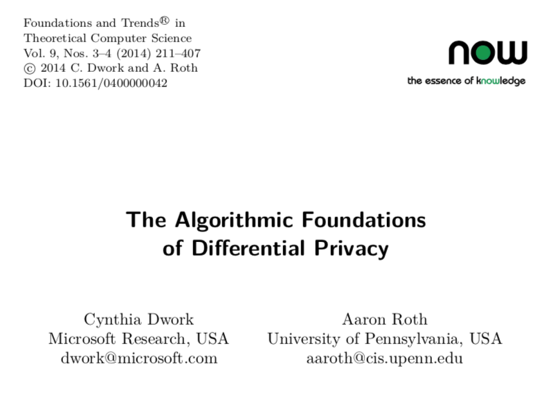

# 差分隐私算法基础
*The Algorithmic Foundation of Differential Pivacy by Cynthia Dwork Chinese Translation*

## 关于本书

  

本书起始于2019年08月，记录了本人从零开始学习 *The Algorithmic Foundation of Differential Pivacy* 的过程。由于差分隐私目前主要研究领域着重于学术界，对于 Cynthia Dwork 女士的《差分隐私算法基础》目前没有一本完整的中文翻译书籍。通过在学习过程中翻译该书籍有助于本人理解差分隐私概念与算法基础。因此希望将该书翻译成中文，能够帮助大家理解差分隐私概念，少走弯路，并且在此过程中督促本人学习差分隐私。

## 原书作者
感谢英文原著作者 @Cynthia Dwork 和 @Aaron Roth《[The Algorithmic Foundation of Differential Pivacy](https://www.cis.upenn.edu/~aaroth/Papers/privacybook.pdf)》。有了 Cynthia Dwork 女士才有了差分隐私的一切

## 译者
guoJohnny @guoJohnny

## 项目源码

项目源码存放于 Github 上，[https://github.com/guoJohnny/algorithmic-foundation-of-dp-zh-cn](https://github.com/guoJohnny/algorithmic-foundation-of-dp-zh-cn)。

## 欢迎建议指正或直接贡献翻译
https://github.com/guoJohnny/algorithmic-foundation-of-dp-zh-cn/issues

## LICENSE

[署名-非商业性使用-相同方式共享 4.0 (CC BY-NC-SA 4.0)](https://creativecommons.org/licenses/by-nc-sa/4.0/deed.zh)。

